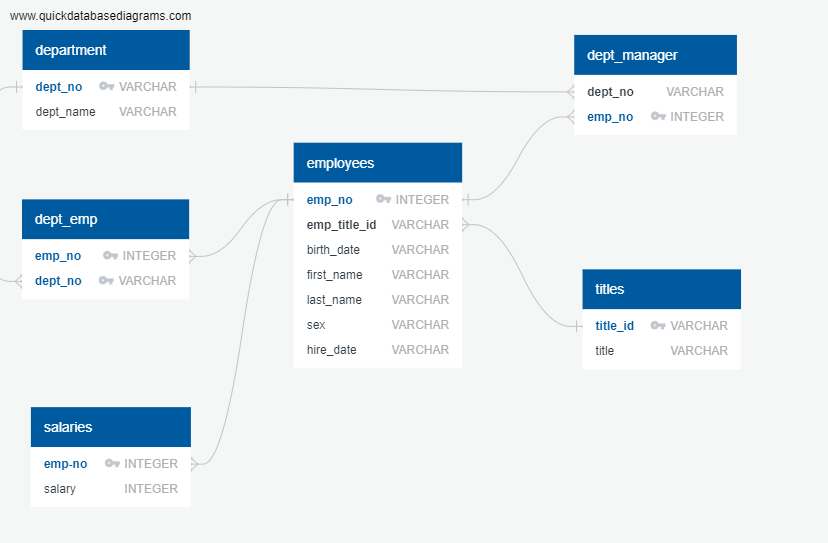

# Research Project on Employees

## About The Project

### Background

* As a new data engineer at Pewlett Hackard, my first major task is a research project on employees of the corporation from the 1980s and 1990s.

* All the data is included in six CSV files. 

* Task 1: Data engineering. 
    * Design the tables to hold data in the CSVs, and import the CSVs into a SQL database

* Task 2: Data analysis. 
    * Answer questions about the data. 
### Dataset

* Six csv files in the folder of CSVs

1. Department name
2. Employees' department
3. Manager of each department
4. Employee personal information
5. Employee's salary
6. Title name

### Built With

* PostgreSQL
* Python
* Jupyter Notebook

## Procedures

### 1. Inspect the CSVs and sketch out an ERD of the tables.

### 2. Creat a table schema for each of the six CSV files. Define data types,   primary keys, foreign keys, and other constraints.
* Primary keys should be unique, otherwise create a composite key to uniquely identify a row.
* All table schema can be found in "schema.sql" file.
* Use PostgreSQL as our database, creat 6 tables using the "schema.sql"
* Tables should be created in correct order to handle foreign keys.
* Import each CSV to corresponding SQL table, be sure to import the data in the same order that the tables were creawted and account for the headers when importing to avoid errors.

### 3. 

*

## Findings 
### 1. Statistical summary (full table in Jupyter notebook)
   

### 2. Distribution of each attribute value 
   

### 3. Correlation coefficients matrix
  * 3 paris of strong correlation
  * "PURCHASES" and "ONEOFF_PURCHASES" -- 0.92
  * "PURCHASES_FREQUENCY" and 'PURCHASES_INSTALLMENT_FREQUENCY' --0.86
  * "CASH_ADVANCE_TRX" and "CASH_ADVANCE_FREQUENCY" --0.8
  

### 4. Divide customres into 8 clusters according to "Elblow Method"
  

### 5. Statistical summary for each cluster (full table in Jupyter notebook)
  

  * Credit card issuers usually have more interests in "Transactors" and "Revolvers"
  * Cluster 6 belongs to "Transactors": Those are customers who pay least amount of intrerest charges and careful with their money, Cluster with lowest balance ($104) and cash advance ($303), Percentage of full payment = 23%
  * Cluster 0 belongs to "Revolvers" who use credit card as a loan (most lucrative sector): high balance (more than $5000) and cash advance (more than$5000), low purchase frequency, high cash advance frequency (0.52), high cash advance transactions (16) and low percentage of full payment (3.8%)

### 6. Visualizations of balance distribution for each cluster (distribution for other attributes can be found in Jupyter notebook)

  

### 7. Visualize the clusters in 2-axies plane
  

## Raw Data Explanation

## References
* [Market Segmentation from Wikipedia](https://en.wikipedia.org/wiki/Market_segmentation)

