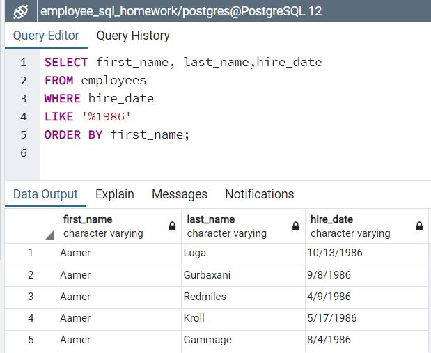
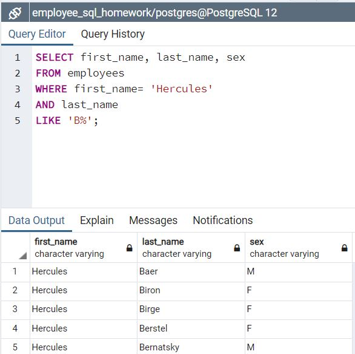
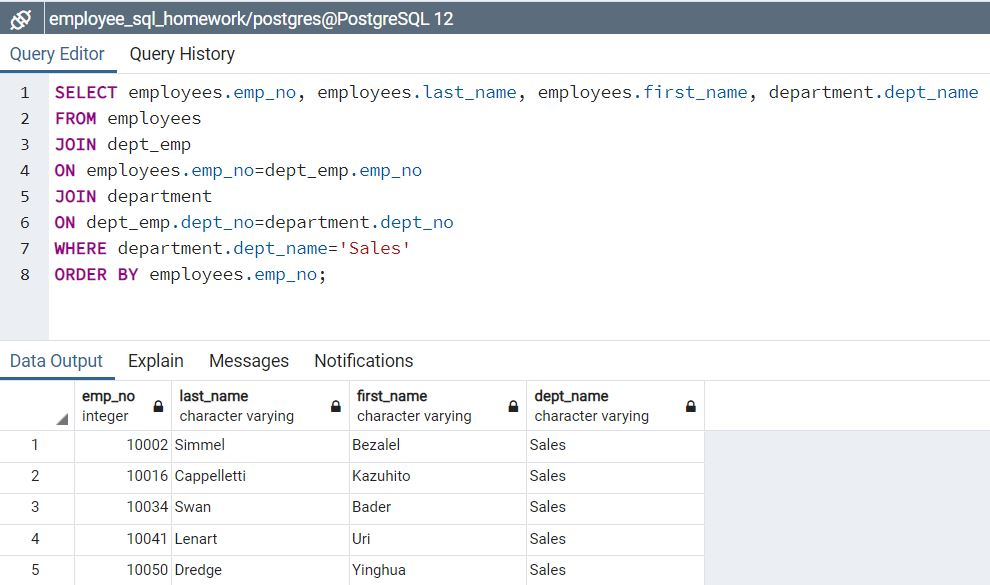
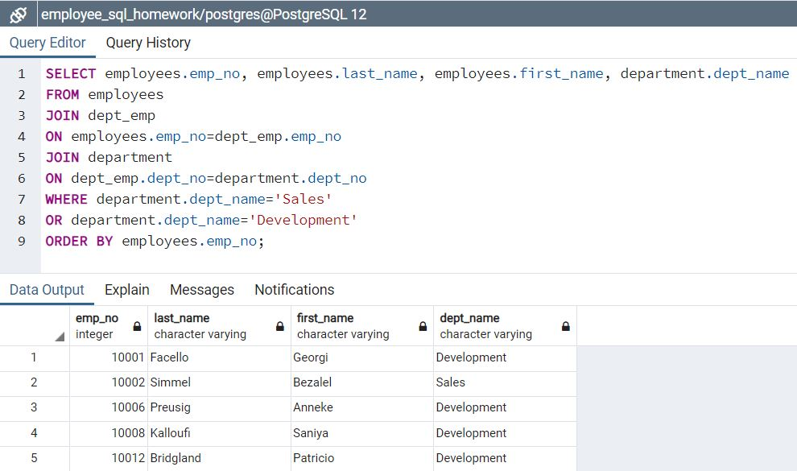

# Research Project on Employees

## About The Project

### Background

* As a new data engineer at Pewlett Hackard, my first major task is a research project on employees of the corporation from the 1980s and 1990s.
* All the data is included in six CSV files. 
* Task 1: Data engineering. 
    * Design the tables to hold data in the CSVs, and import the CSVs into a SQL database
* Task 2: Data analysis. 
    * Answer questions about the data. 

### Dataset

* Six csv files in the folder of CSVs
    * Department name
    * Employees' department
    * Manager of each department
    * Employee personal information
    * Employee's salary
    * Title name

### Built With

* PostgreSQL
* Python
* Jupyter Notebook

## Procedures

### 1. Inspect the CSVs and sketch out an ERD of the tables.

### 2. Creat a table schema for each of the six CSV files. Define data types,   primary keys, foreign keys, and other constraints.
* Use [QUICK DBD](http://www.quickdatabasediagrams.com) to sketch out ERD
* Primary keys should be unique, otherwise create a composite key to uniquely identify a row.
* Use PostgreSQL as our database, creat 6 tables using the "schema.sql"
* Tables should be created in correct order to handle foreign keys.
* Import each CSV to corresponding SQL table, be sure to import the data in the same order that the tables were creawted and account for the headers when importing to avoid errors.
* All table schema can be found in "schema.sql" file.

### 3. Data analysis.
* List the following details of each employee: employee number, last name, first name, sex, and salary.

* List first name, last name, and hire date for employees who were hired in 1986.

* List the manager of each department with the following information: department number, department name, the manager's employee number, last name, first name.

* List the department of each employee with the following information: employee number, last name, first name, and department name.

* List first name, last name, and sex for employees whose first name is "Hercules" and last names begin with "B."

* List all employees in the Sales department, including their employee number, last name, first name, and department name.

* List all employees in the Sales and Development departments, including their employee number, last name, first name, and department name.

* In descending order, list the frequency count of employee last names, i.e., how many employees share each last name.

* All SQL query code can be found at "query.sql" 

### 4. Data visualization

* Import the PostgreSQL database into Pandas.
* Create a histogram to visualize the most common salary ranges for employees.

* Create a bar chart of average salary by title.

* All Python code can be found in "data_analysis.ipynb"

